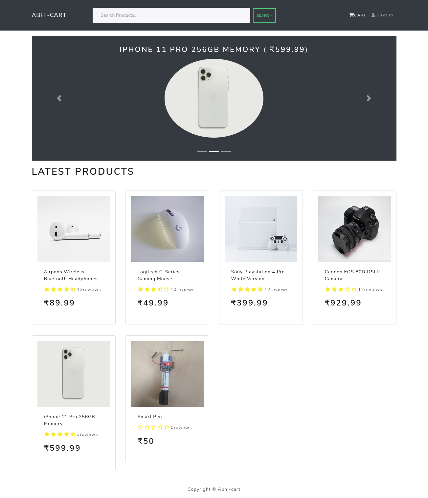

# AbhiCart
### [Livesite](https://abhicart.herokuapp.com/)

This website uses React.js for frontend Nodejs,Express for backend and MongoDB for Database.
It has login/signup,add to cart,order status,Payment,admin,user features.
admin can add,delete or edit Users,Products from website.
user can give rating,feedback to product once.pm i && npm start in both frontend a
pagination and search are also added

setup:
- run `npm i && npm start` in both frontend and  backend
